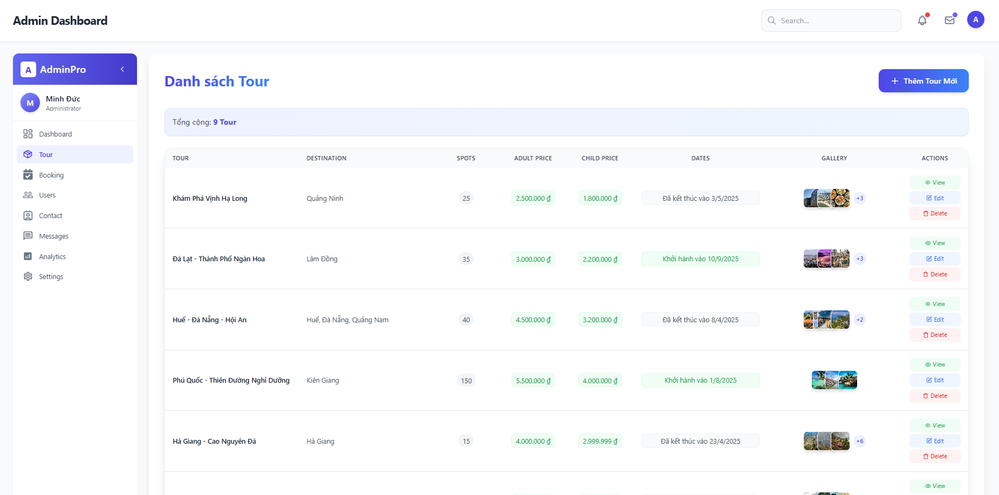
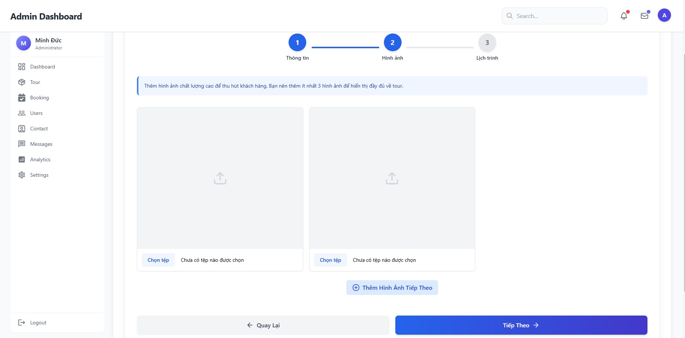
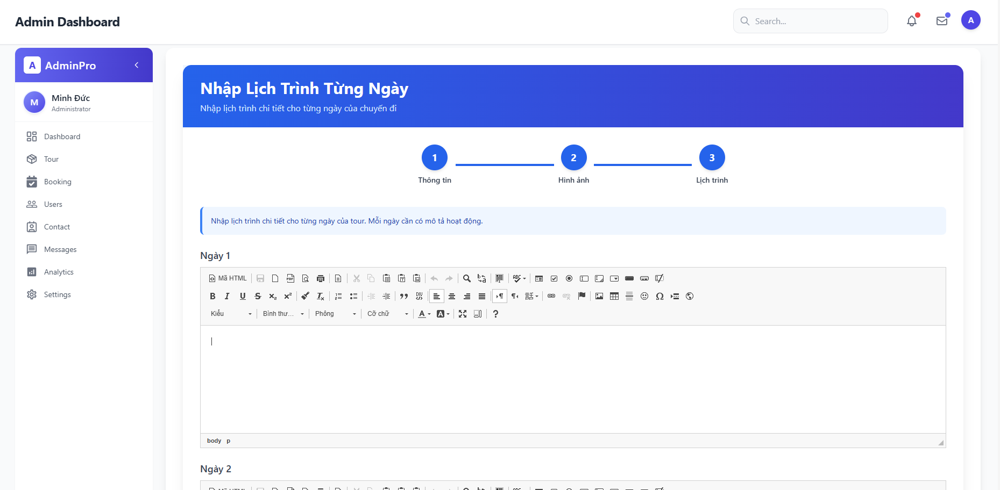
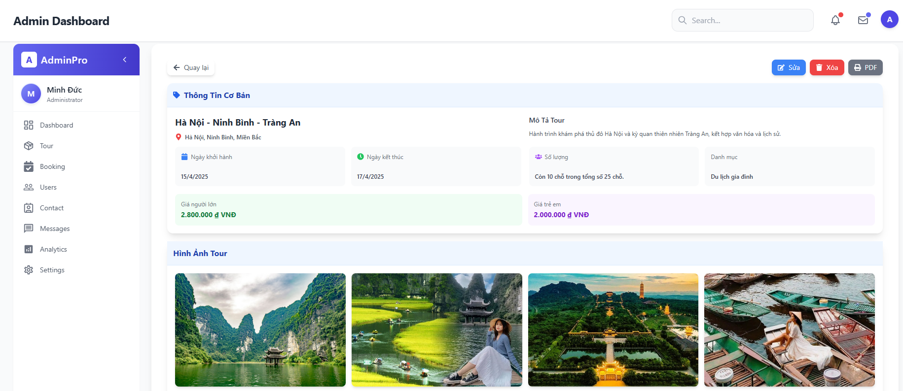
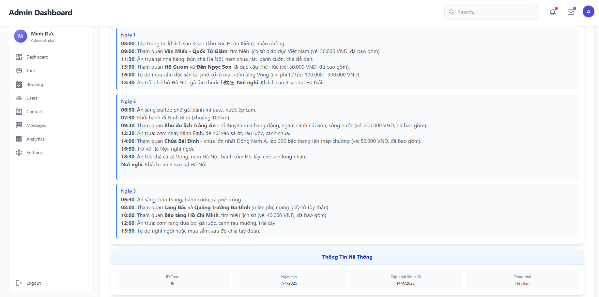
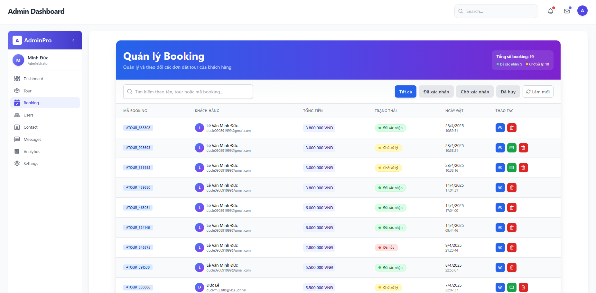
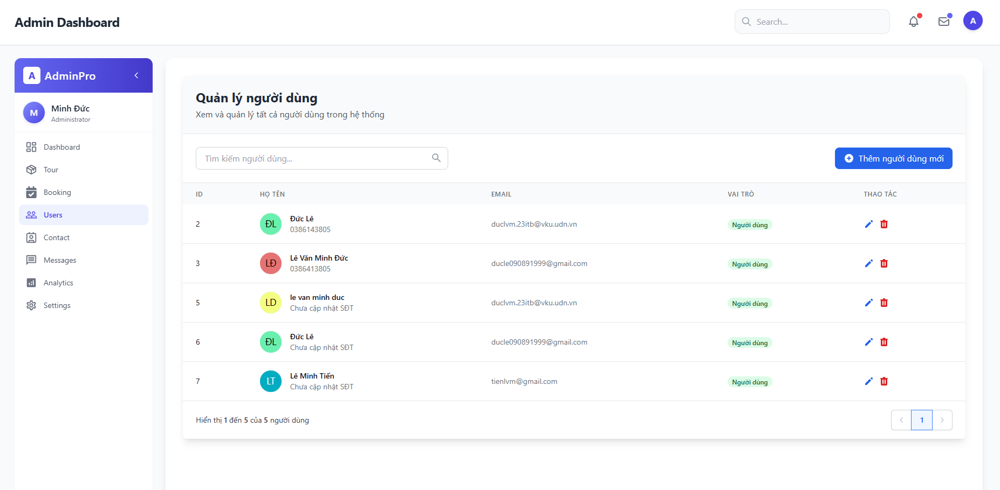
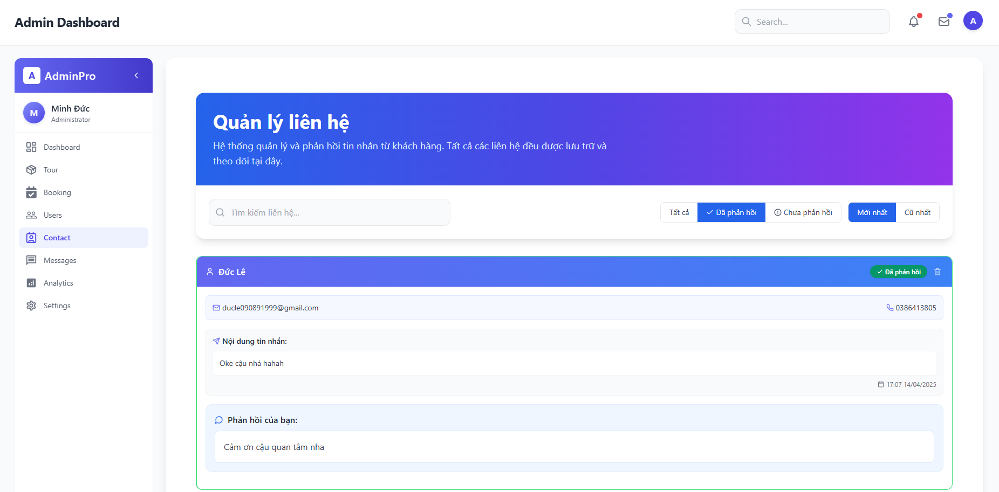
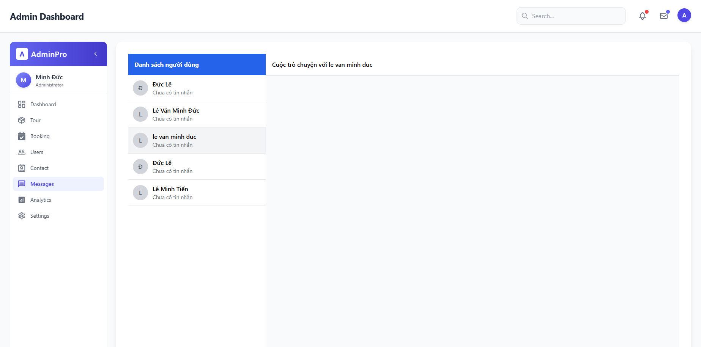

# 🚀 Express.js API – Setup và Ghi chú sử dụng

## 📦 Các Package đã cài đặt

### ✅ Kết nối Database (MySQL + Sequelize)
```bash
npm install sequelize mysql2
```
> Kết nối với MySQL sử dụng Sequelize.

---

### 🔁 Reload Server khi thay đổi mã
```bash
npm install --save-dev nodemon
```

---

### 🔐 Xác thực và Bảo mật
```bash
npm install jsonwebtoken
```
> Tạo và xác thực JWT.

```bash
node -e "console.log(require('crypto').randomBytes(64).toString('hex'))"
```
> Tạo secret key để sử dụng trong JWT.

```bash
npm install bcryptjs
```
> Mã hoá mật khẩu và so sánh mật khẩu.

```bash
npm install dotenv
```
> Quản lý biến môi trường.

```bash
npm install cookie-parser
```
> Lưu token vào cookie.

---

### 🌐 API & Giao tiếp
```bash
npm install cors
```
> Cho phép giao tiếp giữa frontend và backend.

```bash
npm install axios
```
> Gửi HTTP requests từ client.

---

### 📩 Gửi Email
```bash
npm install nodemailer
```

---

### 📤 Upload Ảnh
```bash
npm install multer
```

---

### 💬 Chat real-time với Socket
```bash
npm install socket.io
```

---

### 📧 Hàng đợi gửi mail (Bull + Redis)
```bash
npm install bull
npm install redis
```

> Redis khởi chạy với:
```bash
redis-server --port 6380
```

---

### 📆 Tác vụ định kỳ
```bash
npm install node-cron
```
> Dùng để chạy tự động kiểm tra đơn hàng chưa thanh toán hoặc hết hạn.

---

### 📦 QR Code
```bash
npm install qrcode
```

---

### 🔐 Xác thực bằng Google
```bash
npm install passport passport-google-oauth20
```

---

## 🧱 Sequelize – Thao tác CRUD

### 🔹 Tạo dữ liệu (Create)
```js
const newUser = await User.create({
  username: "john_doe",
  email: "john@example.com",
  password: "123456",
});
console.log(newUser.toJSON());
```

### 🔹 Đọc dữ liệu (Read)
```js
const users = await User.findAll();
console.log(users.map(user => user.toJSON()));
```

---

## 🔗 Quan hệ giữa các Model

### 🔸 One-to-One
```js
User.hasOne(Profile);
Profile.belongsTo(User);
```

### 🔸 One-to-Many
```js
User.hasMany(Post);
Post.belongsTo(User);
```

### 🔸 Many-to-Many
```js
Post.belongsToMany(Tag, { through: PostTag });
Tag.belongsToMany(Post, { through: PostTag });
```

---

## 🔍 Các Query nâng cao trong Sequelize

### ✔️ Điều kiện nâng cao (OR)
```js
const users = await User.findAll({
  where: {
    [Op.or]: [{ username: "john_doe" }, { email: "john@example.com" }],
  },
});
```

### ✔️ Chọn cột cụ thể
```js
const users = await User.findAll({ attributes: ["id", "username"] });
```

### ✔️ Sắp xếp dữ liệu
```js
const users = await User.findAll({ order: [["username", "ASC"]] });
```

### ✔️ Giới hạn và phân trang
```js
const users = await User.findAll({ limit: 10, offset: 20 });
```

### ✔️ Nhóm dữ liệu (GROUP BY)
```js
const result = await Post.findAll({
  attributes: ["userId", [sequelize.fn("COUNT", sequelize.col("id")), "postCount"]],
  group: ["userId"],
});
```

---

## 🧠 SQL Functions với `sequelize.fn`

### 🔸 Tổng (SUM)
```js
const totalRevenue = await Order.findAll({
  attributes: [[sequelize.fn("SUM", sequelize.col("total_price")), "total_revenue"]],
});
```

### 🔸 Đếm (COUNT)
```js
const totalUsers = await User.findAll({
  attributes: [[sequelize.fn("COUNT", sequelize.col("id")), "total_users"]],
});
```

### 🔸 Tính số ngày giữa 2 cột (DATEDIFF)
```js
const result = await Tour.findAll({
  attributes: [
    [sequelize.fn("DATEDIFF", sequelize.col("end_date"), sequelize.col("departure_date")), "duration"],
  ],
});
```

---

## 🧑‍💻 Giao diện quản trị viết bằng React

### 📍 Giao diện Trang Tour


---

### ➕ Giao diện Thêm Tour
  
  


---

### 🔎 Giao diện Chi Tiết Tour
  


---

### 📋 Giao diện Quản lí Booking Tour


---

### 👤 Giao diện Quản lí Người Dùng


---

### 📞 Giao diện Liên Hệ


---

### 💬 Giao diện Quản lí Tin Nhắn (Chat)

